# 3D Modelling Project: Zombie Attack!

## Final result
[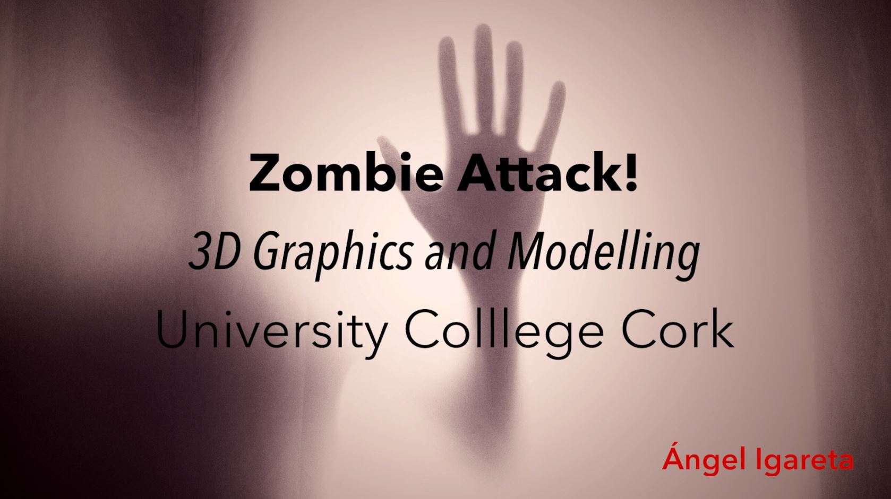](https://www.youtube.com/watch?v=fQO7BVK7Sro)

## Description
Project for the subject 3D Graphics and Modelling on University College Cork. The work consist on creating a one-minute CG Animation using the open software *Blender*. The short-film will be based on a Zombie attack that occurs on the UCC Quad. Besides, there has to be an original character created from scratch.

## Process
### Modelling the character Brush
For the purpose of the character creation, a fictional character's sketch was taken from Google. It consisted on 3 views, a front view, a lateral view and an aerial view of the hand. Those images where:

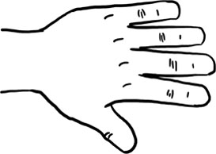

The first part of the character being modelled was the head. The faces that formed this head were created according to the facial muscles, in order to ease the face animation in the future. As the human body is almost symmetric on both sides, we used the mirror modifier when modelling the body.

During the process, some screenshots were taken to illustrate the process of modelling the hardest parts. Moreover, images were used as background to facilitate the creation of faces. Here there is a list of them:

* Modelling Character 1: 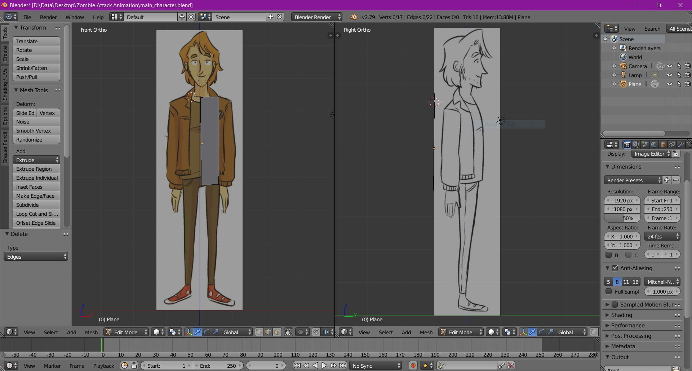
* Modelling Character 2: 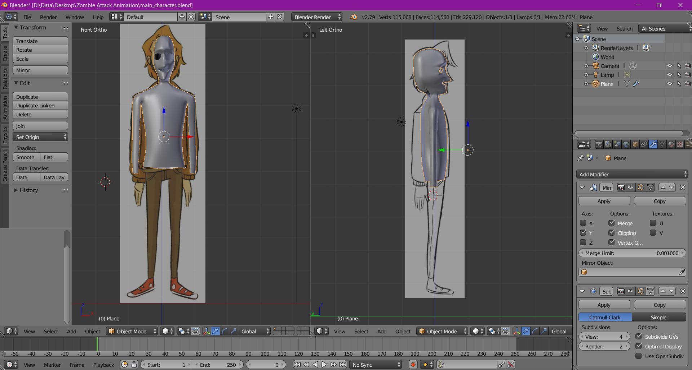
* Hand Part 1: 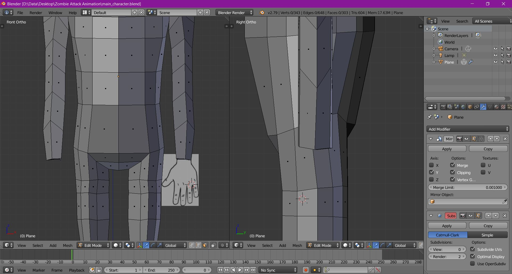
* Hand Part 2: 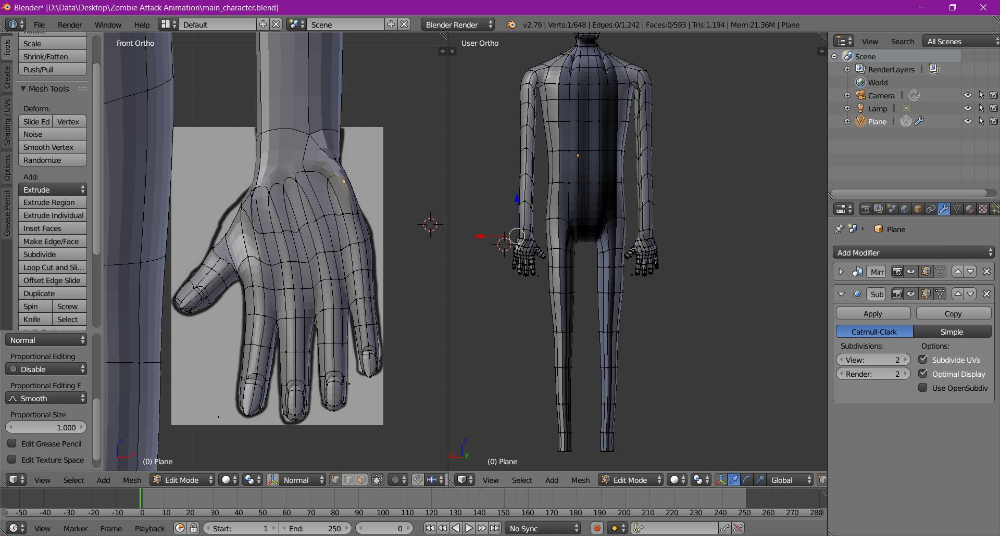
* Legs Part 1: 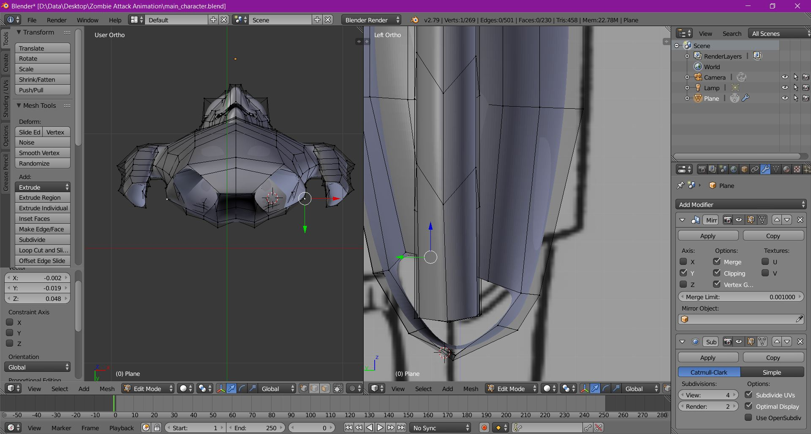
* Legs Part 2: 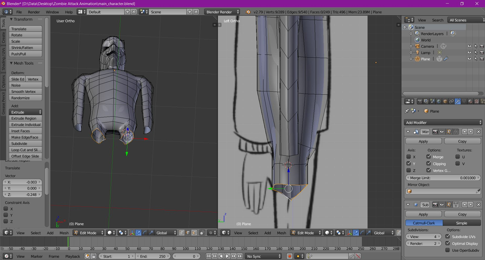
* Legs Part 3: 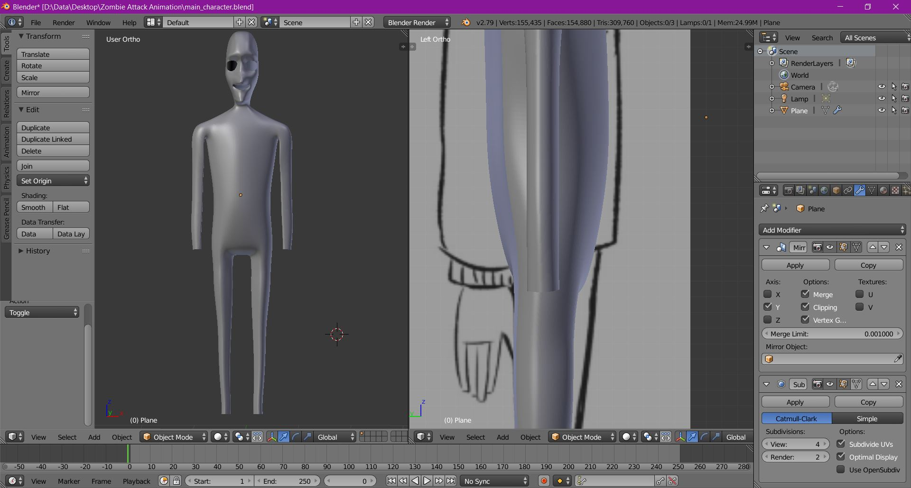
* Body Finished: 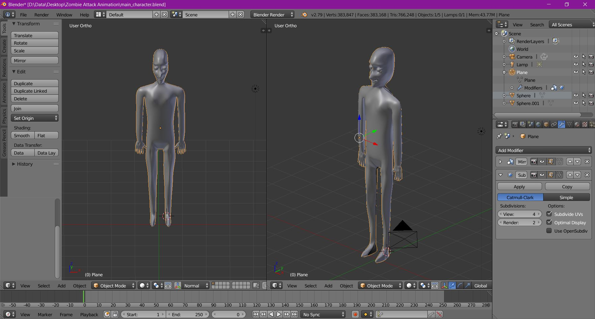

The character was smoothed using SubSurf technique. The next step was adding the texture, hair particles and clothes (shirt, belt, pants and boots). For the skin, eyes, belt and pants UV Mapping was used. All the textures can be found in [Textures](images/textures), some of them were taken from [Textures](https://www.textures.com). The final result of the character with the clothes is:

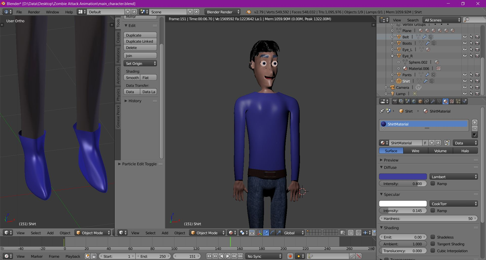

On top of that, before designing the Storyboard, I added Inverse Kinematics to my character, allowing him to walk.

### Modelling the UCC Quad
The short film scenario is the UCC Quad, so it must be modelled. Despite it was not necessary doing it from scratch, I decided to model the buildings without any external resource, using only a real picture of the Quad. The benches, doors and windows were taken from [TurboSquid](https://www.turbosquid.com) and [Free3D](https://free3d.com). The buildings were smoothed using Bevel modifier.

Finally, when adding the trees, in order to improve the performance of the rendering, I decided to include only low-poly trees.

### Animation
The Storyboard consist on the following scenes:
* Scene 1: Aerial view of the UCC Quad.
* Scene 2: Change camera position to focus the character entering in the Quad, showing the walking animation while it moves towards the camera.
* Scene 3: Change camera position to a frontal view of a bench and show how the character reaches it.
* Scene 4: Close-up scene where the character sits on the bench.
* Scene 5: Brush moves the neck smoothly from side to side and see the zombies. (With Surprise Sound)
* Scene 6: Focus several zombies walking out the arch of the front building. (With Zombie Sound)
* Scene 7: Close-up scene where the character freaks out, moving the hands to its head.
* Scene 8: Zombies are all over the gardens of the Quad. (Intense Music)
* Scene 9: Ironman comes and terminates with the Zombies. (From lateral View with the Zombies)
* Scene 10: Scene of Ironman and Brush. (With Birds Sound)

It was composed using Adobe Premiere Pro CC, where color correction, sound and video transitions where added.

## Bibliography
* Blender Character Modelling: [Blender Character Modelling](https://www.youtube.com/watch?v=0QT1GNMevfc)
* Basic Walk Cycle: [Basic Walk Cycle](https://www.youtube.com/watch?v=d-wQ8nRWTBs)

## Attribution
* Door: [Door](https://free3d.com/3d-model/medieval-door-16986.html)
* Benches: [Benches](https://www.turbosquid.com/FullPreview/Index.cfm/ID/1030323)
* Windows: [Windows](https://www.turbosquid.com/FullPreview/Index.cfm/ID/576606)
* Low-Poly Trees: [Low-Poly Trees](https://www.turbosquid.com/FullPreview/Index.cfm/ID/785923)
* Building Texture: [Building Texture](https://www.textures.com/download/3dscans0028/126904)
* Building Roof Texture: [Building Roof Texture](https://www.textures.com/download/3dscans0118/132150)
* Grass Texture: [Grass Texture](https://www.turbosquid.com/FullPreview/Index.cfm/ID/1309955)
* Zombie: [Zombie](https://clara.io/view/c584ee5d-e6d5-479f-af01-df569e20390e)
* Ironman: [Ironman](https://clara.io/view/9c0513fa-818a-46a9-9519-9f92be94e69f)
* Intro Image: [Intro Image](https://pixabay.com/es/mano-silueta-forma-horror-984170/)
* Zombie sound: [Zombie sound](https://freesound.org/people/Under7dude/sounds/163440/)
* Screaming sound: [Screaming sound](https://www.freesoundeffects.com/free-sounds/screams-10094/)
* Landing sound: [Landing sound](https://www.freesoundeffects.com/free-track/airland-89247/)
* Laser sound: [Laser sound](https://freesound.org/people/Robinhood76/sounds/414293/)
* Victory sound: [Victory sound](https://freesound.org/people/FunWithSound/sounds/369252/)
* Background music: [Background music](http://freemusicarchive.org/music/Scott_Holmes/Happy_Music/Positive_and_Fun_1951)
* Background music 2: [Background music 2](https://www.bensound.com/royalty-free-music/track/the-duel)

## Author
[Ángel Igareta](https://github.com/angeligareta)
